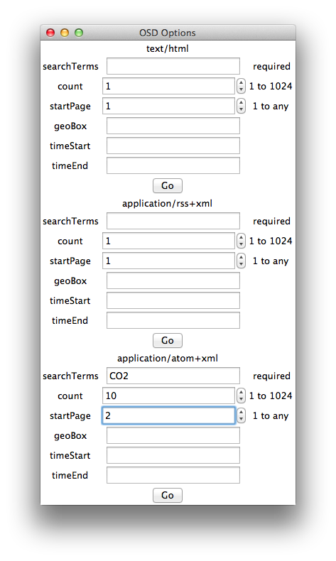
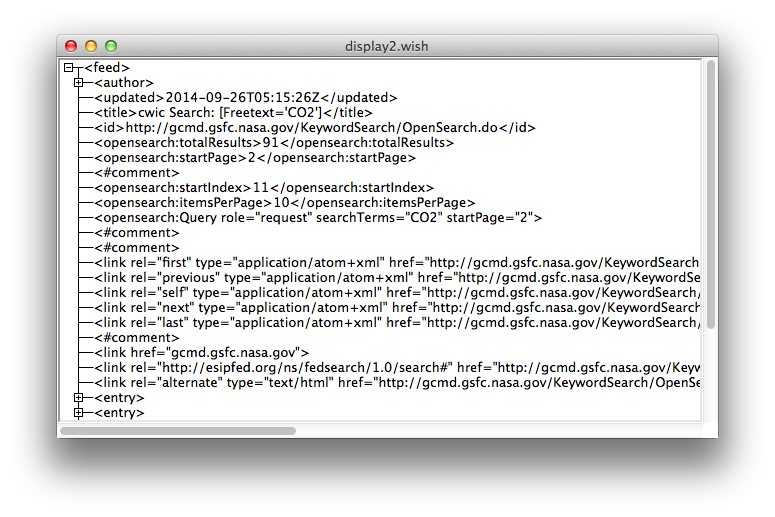

# An OpenSearch Client #

A very quick and dirty set of scripts for downloading metadata from the Global Change Master Directory holdings.

## Requirements ##
* Python
* Tcl
* wish
* BWidget (tree display)
* tDom (parsing)

In MacPorts I did:

* `tk` - not sure if this is needed
* `install bwidget`
* `install py27-tkinter`

# Usage #
`./open.sh -g`

# Credits #
* a lot of help was found at http://wiki.tcl.tk.
* xml viewer was lifted from http://wiki.tcl.tk/3884

 
